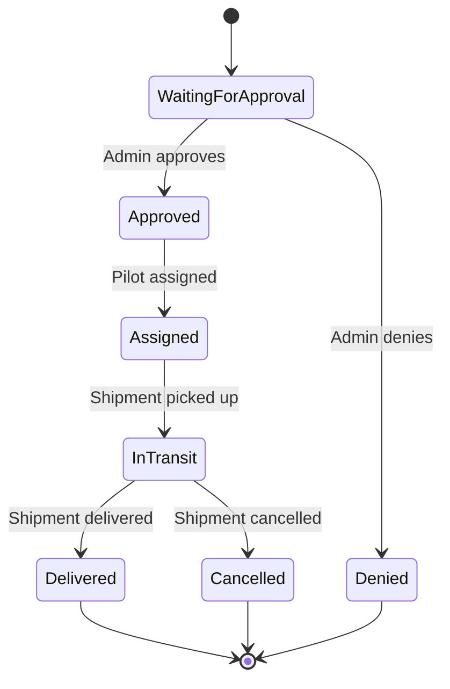

# CosmoCargo Backend

## Prerequisites

- .NET 9.0 SDK
- Docker and Docker Compose
- PostgreSQL (via Docker)

## Setup

1. Clone the repository
2. Navigate to the backend directory
3. Run the following commands:

```bash
# Build and start the containers
docker-compose up -d

# Install dependencies
dotnet restore

# Run the application
dotnet run
```

## Database Management

### Backup Database

To create a backup of the database:

```bash
cd scripts
backup_database.bat
```

This will:
- Create a timestamped backup in the `backups` directory
- Keep only the last 5 backups
- Show progress with timestamps
- Handle errors gracefully

### Restore Database

To restore the database from a backup:

```bash
cd scripts
restore_database.bat "backups\cosmocargo_backup_YYYYMMDD-HHMMSS.sql"
```

This will:
- Drop and recreate the database
- Restore from the specified backup file
- Show progress with timestamps
- Handle errors gracefully

### Notes

- Backups are stored in the `backups` directory
- The scripts automatically manage the Docker container
- Only the last 5 backups are kept to save disk space
- All operations include timestamps for better tracking

## API Documentation

The API documentation is available at `/swagger` when running the application.

## Environment Variables

The following environment variables are used:

- `ConnectionStrings:DefaultConnection`: PostgreSQL connection string
- `Jwt:Key`: JWT secret key
- `Jwt:Issuer`: JWT issuer
- `Jwt:Audience`: JWT audience
- `Jwt:ExpiryMinutes`: JWT expiration time in minutes

## Testing

To run the tests:

```bash
dotnet test
```

## License

This project is licensed under the MIT License.

## Databashantering

### Förutsättningar
- .NET SDK 9.0
- Docker och Docker Compose
- PostgreSQL-klient (valfritt)

### Starta applikationen
Det finns två sätt att köra applikationen:

1. **Kör allt i Docker (rekommenderas)**
```bash
# Från rotkatalogen
docker-compose up -d
```

2. **Kör backend lokalt och databas i Docker**
```bash
# Starta databasen (från rotkatalogen)
docker-compose up db -d

# Starta backend
dotnet run
```

### Databasautomatisering
Databasen hanteras automatiskt av Entity Framework Core. Vid första start:
1. Skapas databasen om den inte finns
2. Körs alla migrationer
3. Seedas testdata

### Ansluta till databasen
PostgreSQL-databasen är tillgänglig på:
- Host: localhost (när du kör utanför Docker)
- Host: db (när du kör inom Docker-nätverket)
- Port: 5432
- Databas: cosmocargo
- Användare: postgres
- Lösenord: postgres

### Använda pgAdmin
pgAdmin är tillgängligt på http://localhost:5050
- E-post: admin@cosmocargo.com
- Lösenord: admin

För att ansluta till databasen i pgAdmin:
1. Högerklicka på "Servers" och välj "Create" > "Server..."
2. Ange ett namn (t.ex. "CosmoCargo")
3. Gå till fliken "Connection" och ange:
   - Host: db (använd detta namn i Docker-nätverket)
   - Port: 5432
   - Databas: cosmocargo
   - Användare: postgres
   - Lösenord: postgres
4. Klicka på "Save"

## API-dokumentation

API-dokumentation är tillgänglig:

**Scalar API Reference**
   - Tillgänglig på http://localhost:5000/scalar
   - Modern och användarvänlig gränssnitt
   - Stöd för JWT-autentisering

## Testdata

Systemet seedar automatiskt databasen med testdata vid första start:

### Användare
- Admin: admin@example.com / eT4xD6cV2gN8p
- Pilot: pilot@example.com / zH7yB3tR5wQ9s
- Kund: user@example.com / mKv2P8dXrL9F

### Piloter
- Anna Karlsson: anna.karlsson@cosmocargo.com / pilot123
- Marcus Lindqvist: marcus.lindqvist@cosmocargo.com / pilot123
- Elsa Berg: elsa.berg@cosmocargo.com / pilot123

## Shipment Status Workflow

The shipment status workflow in the system is as follows:



### Status Flow Details

- **Initial State**: `WaitingForApproval`
- **Final States**: `Delivered`, `Cancelled`, `Denied`
- **Role Permissions**:
  - Only admins can approve/deny shipments
  - Only pilots can update status to InTransit
  - Any role can cancel a shipment

### Status Descriptions

- `WaitingForApproval`: Shipment is waiting for admin approval
- `Approved`: Shipment has been approved by admin
- `Denied`: Shipment has been denied by admin
- `Assigned`: Shipment has been assigned to a pilot
- `InTransit`: Shipment is currently in transit
- `Delivered`: Shipment has been delivered to its destination
- `Cancelled`: Shipment has been cancelled

