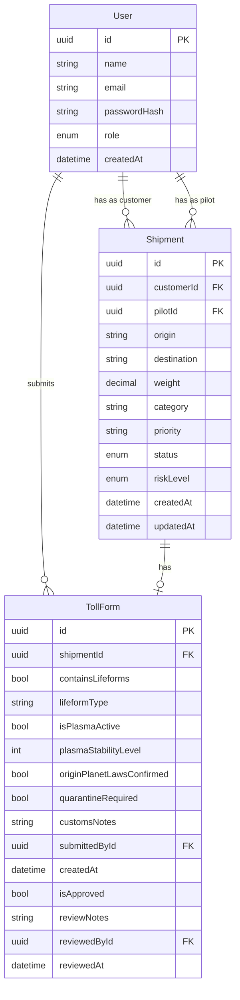

# CosmoCargo Databasdiagram

```mermaid
erDiagram
    User ||--o{ Shipment : "has as customer"
    User ||--o{ Shipment : "has as pilot"
    User ||--o{ TollForm : "submits"
    Shipment ||--o| TollForm : "has"
    
    User {
        uuid id PK
        string name
        string email
        string passwordHash
        enum role
        datetime createdAt
    }
    
    Shipment {
        uuid id PK
        uuid customerId FK
        uuid pilotId FK
        string origin
        string destination
        decimal weight
        string category
        string priority
        enum status
        enum riskLevel
        datetime createdAt
        datetime updatedAt
    }
    
    TollForm {
        uuid id PK
        uuid shipmentId FK
        bool containsLifeforms
        string lifeformType
        bool isPlasmaActive
        int plasmaStabilityLevel
        bool originPlanetLawsConfirmed
        bool quarantineRequired
        string customsNotes
        uuid submittedById FK
        datetime createdAt
        bool isApproved
        string reviewNotes
        uuid reviewedById FK
        datetime reviewedAt
    }
``` 